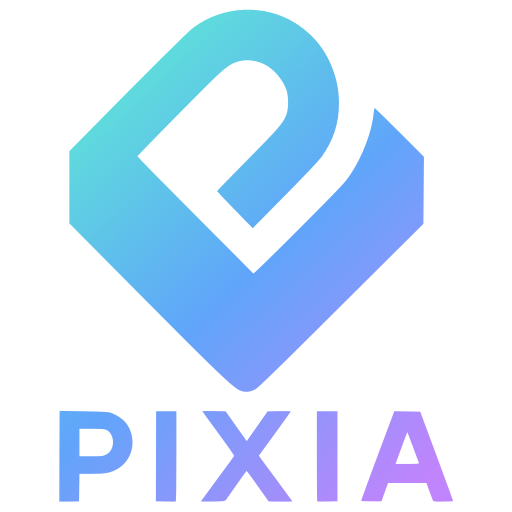
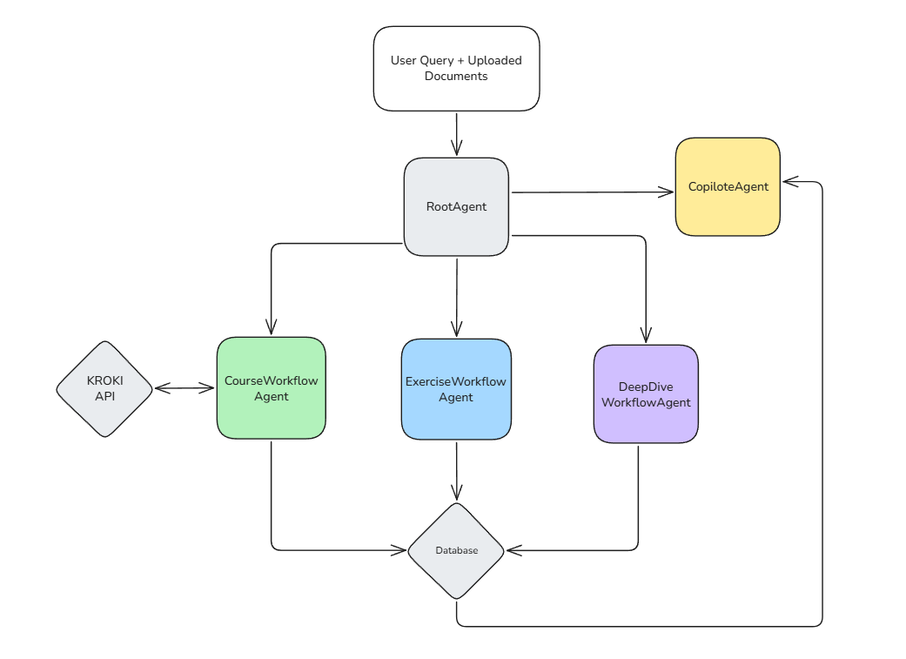
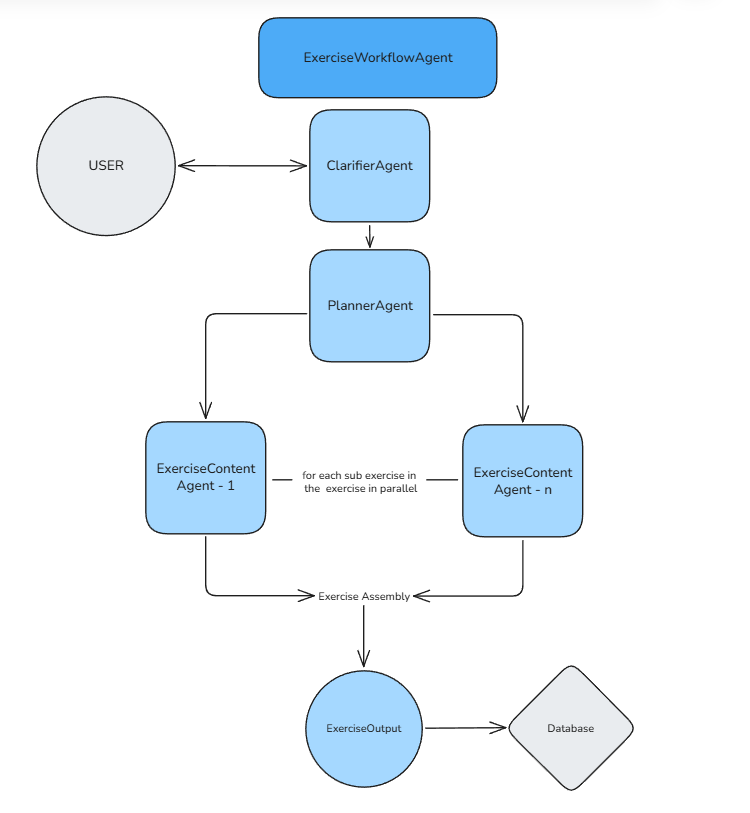
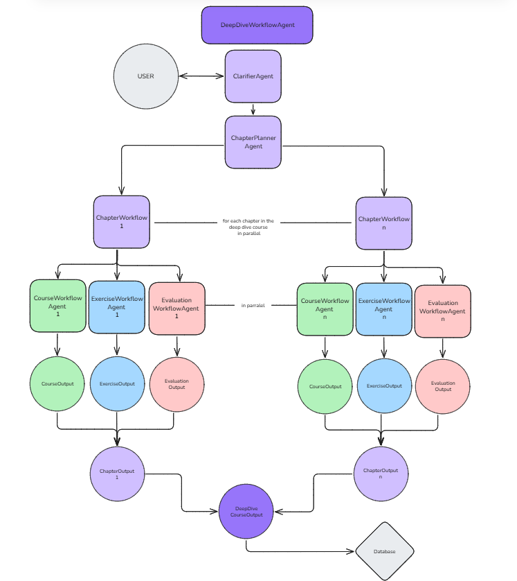
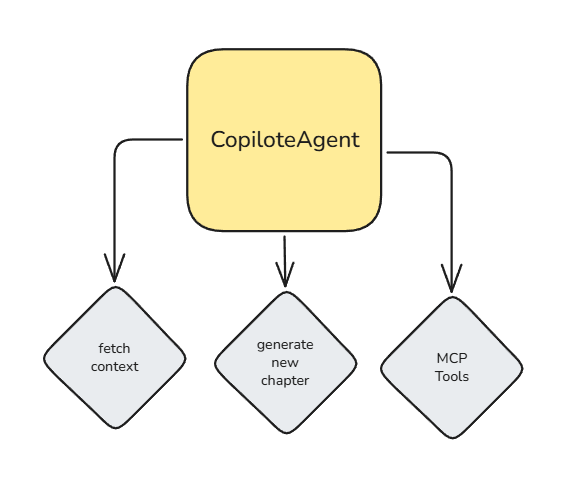

# Pixia — Multi‑agent AI study copilot

<p align="right"></p>

Associated frontend repository :
[Frontend](https://github.com/Tom-dlhy/Hackathon-Frontend)

Live app (hosted frontend):
[Pixia](https://hackathon-frontend-356001158171.europe-west9.run.app/)

**How to use the app** : 
- You will reach a login page which only for tests purposes, it's not operationnal, you can login with `'utilisateur test'` to access an app with some documents already generated.
- You can also create an account using the `signup` button, fill the form, reload the app, login using any password but with the right email and you we'll be able to retrieve all youre documents and chats.

**What is Pixia** : 

Pixia is our submission to GCPU AI for Impact 2025. We focused on education and a familiar pain point: reviewing effectively before an exam with a personal, on‑demand helper. Pixia centralizes this with a multi‑agent architecture (Google ADK), specialized tools (MCP, course/exercise generation), and a FastAPI backend connected to PostgreSQL (Cloud SQL), deployed on Cloud Run.

[Hackathon link](https://www.linkedin.com/posts/activity-7379204410070949889-HJlO?utm_source=share&utm_medium=member_desktop&rcm=ACoAAEPSC7cBdbyR8s3pKeHGnbEqJHbV6P_kqvA)

<details>
    <summary><strong>Full documentation (click to expand)</strong></summary>


## Features

- Unified chat driven by an orchestrator agent that routes to specialized sub‑agents
    - Course generation (detail level: flash/standard/detailed)
    - Exercise generation (MCQ and open questions)
    - Deep course: multi‑chapter generation (per‑chapter course + exercises + evaluation)
    - Add a new chapter to an existing deep course
- Contextual copilots (course/exercise/deep course) with controlled access to Microsoft Learn via MCP (Only high quality open-MCP😅)
- Multimodal inputs (PDF, etc.) attached to the session context
- Export courses to PDF
- Track chapter progress (complete/incomplete)
- Progressive correction
    - MCQ: mark questions as corrected
    - Open questions: on‑demand corrections and annotations
- Personal context awareness (study level)

## High‑level architecture

- React frontend → calls FastAPI backend (`/api/...`)
- FastAPI backend
    - Agent orchestrator (Google ADK) + specialized sub‑agents
    - ADK session services (in‑memory and database)
    - In‑memory artifact service (files)
    - Internal tools (generate courses/exercises, new chapter, deep course)
- Storage
    - PostgreSQL (Cloud SQL) for business entities: `users`, `deepcourse`, `chapter`, `document`
    - ADK tables (sessions, events, states) auto‑created by ADK

### Data flow: DB → DTO → API → Frontend

1) The frontend sends a request (often `multipart/form-data`) to `/api/chat` or another business route.
2) The FastAPI route:
     - initializes request context (document_id, session_id, user_id, deep_course_id)
     - resolves or creates the ADK session (in‑memory, for precisions → fallback DB)
     - loads artifacts (e.g., PDFs) and attaches them to context
     - runs the ADK Runner on the orchestrator agent
3) The orchestrator selects a sub‑agent (course, exercises, deep course, copilots) and calls tools (e.g., `generate_courses`, `generate_exercises`, `generate_deepcourse`, `generate_new_chapter`).
4) Tools output Pydantic models (`CourseOutput`, `ExerciseOutput`, `DeepCourseOutput`), optionally persisted in the `document` table.
5) The API returns a standardized `ChatResponse` to the frontend (text + agent metadata + optional `redirect_id` that allows the frontend to redirect the user to the created document).

### Multi‑agents and tools

- Root `LlmAgent` (orchestrator): `src/agents/root_agent/orchestrateur.py`
- Sub‑agents:
    - `ExerciseAgent` → `generate_exercises`
    - `CourseAgent` → `generate_courses`
    - `DeepcourseAgent` → `generate_deepcourse`
    - Copilots (exercise/course/new chapter) → context tools + MCP Microsoft Learn

Prompts live under `src/prompts/`.




### Graph








### Context and sessions

- Request context via `ContextVar` (`src/utils/request_context.py`) to share IDs with tools.
- ADK sessions:
    - InMemory or Database (`DatabaseSessionService`) depending on where the session exists
    - Retry mechanism with valid‑event duplication if a session becomes corrupted
- Artifacts (files) kept in memory via `InMemoryArtifactService` and re‑injected into subsequent calls.

### Data model / database

Business tables (`src/bdd/schema_sql.py`):

- `users(google_sub, email, name, notion_token, study, created_at)`
- `deepcourse(id, titre, google_sub)`
- `chapter(id, deep_course_id, titre, is_complete)`
- `document(id, google_sub, session_id, chapter_id, document_type, contenu JSON, created_at, updated_at)`

Notes:

- ADK tables (sessions, events, states) are created by `DatabaseSessionService` (ADK).
- Generated content is stored as structured JSON in `document.contenu` (Pydantic schemas). 
- Foreign keys from ADK tables to business tables are not established on the ADK side (future improvement, we weren't able to fix it).

## API overview

All routes are prefixed by `/api`.

- `GET /api/health` → status
- `POST /api/chat` → multi‑agent chat
    - body: `Form(user_id, message, session_id?, deep_course_id?, document_id?, message_context?, files?)`
    - response: `ChatResponse { session_id, answer, agent?, redirect_id? }`
- `POST /api/fetchallchats` → user’s non‑chapter documents sessions
- `POST /api/fetchalldeepcourses` → deep course list + completion
- `POST /api/fetchallchapters` → deep course chapters
- `POST /api/fetchchapterdocuments` → per‑chapter course/exercise/eval sessions
- `POST /api/markchaptercomplete | markchapteruncomplete`
- `POST /api/correctplainquestion | markcorrectedQCM`
- `POST /api/signup | login | changesettings`
- `POST /api/downloadcourse` → export PDF


## Key Pydantic models

- `CourseOutput` (`src/models/cours_models.py`): `title`, `parts[]` (markdown, Mermaid/PlantUML/Graphviz diagrams, base64 image via Kroki)
- `ExerciseOutput` (`src/models/exercise_models.py`): MCQ and Open, incremental correction
- `DeepCourseOutput` (`src/models/deepcourse_models.py`): chapters { course, exercice, evaluation }
- `ChatResponse` (`src/dto/chat.py`)


## Tech stack

- Backend: Python 3.12, FastAPI
- AI orchestration: Google ADK + Gemini (google‑genai)
- MCP: Microsoft Learn (via MCPToolset)
- DB: PostgreSQL (Cloud SQL) + SQLAlchemy async + asyncpg
- Deployment: Cloud Run
- Dependency management and scripts: `uv` (Astral)
- Frontend: React + Tanstack


## Prerequisites

- Python 3.12+
- `uv` installed: https://docs.astral.sh/uv/
- Reachable PostgreSQL (Cloud SQL or local)

## Configuration (.env)

Create a `.env` file at the backend root with at least:

```
# App
APP_NAME=Pixia
ENV=dev
HOST=0.0.0.0
PORT=8080
DEBUG=true

# DB
DB_USER_SQL=...
DB_PASSWORD_SQL=...
DB_NAME_SQL=...
DB_HOST_SQL=...
DB_PORT_SQL=5432

# Google GenAI (Gemini)
GOOGLE_API_KEY=...
GEMINI_MODEL_2_5_FLASH=models/gemini-2.5-flash
GEMINI_MODEL_2_5_FLASH_LITE=models/gemini-2.5-flash-lite
GEMINI_MODEL_2_5_FLASH_LIVE=models/gemini-2.5-flash-live
GEMINI_MODEL_2_5_FLASH_IMAGE=models/gemini-2.5-flash-image

# Auth (experimental — currently mocked)
# Authentication is temporarily disabled. Only email matching is used,
# passwords are ignored, and no real token validation occurs.
OIDC_GOOGLE_CLIENT_ID=...
GOOGLE_CLIENT_SECRET_B64=...
JWT_SECRET_KEY=...
ACCESS_TOKEN_EXPIRE_MINUTES=120
```


## Local development

1) Clone backend and frontend

```bash
git clone https://github.com/Tom-dlhy/Hackathon-Backend
git clone https://github.com/Tom-dlhy/Hackathon-Frontend
```

2) From the backend folder, sync and start in dev

```bash
uv sync
uv run dev
```

3. Follow the setup instructions in the [Pixia Frontend](https://github.com/Tom-dlhy/Pixia-Frontend) repository


### Local production run

```
uv run prod
```

## Known limitations / Roadmap

- Put the DB in a dedicated container
- Deeper personalization (learner profile, targeted RAG)
- Course editing assisted by the copilot
- Route all payloads through stable, dedicated DTOs
- Optimize deep course generation time
- More robust alternative to Kroki for some diagrams (math)
- Harden network security
- Full authentication/authorization
- ADK foreign keys to business tables are not exposed currently
- UI/UX enhancements: delete/rename chapter/chat, etc.
- Integrations: Notion / Google Docs
- Controlled web search

## Team

We are five M2 students in Data & AI at ESILV.


- Tom Delahaye
    - https://github.com/Tom-dlhy
    - https://www.linkedin.com/in/tom-delahaye4/
- Gabriel Carlotti
    - https://github.com/GabrielCarlotti
    - https://www.linkedin.com/in/gabriel-carlotti-7b3087279/
- Pierre Briand
    - https://github.com/PierreB33
    - https://www.linkedin.com/in/pierre-briand-40a08126b/
- Alexandre Laroudie
    - https://github.com/AlexLaroudie
    - https://www.linkedin.com/in/alexandre-laroudie/
- Kentin Guillemot
    - https://github.com/KentinGuillemot
    - https://www.linkedin.com/in/kentin-guillemot-818651233/

## Resources & links

- Frontend: https://github.com/Tom-dlhy/Hackathon-Frontend
- ADK (Google ADK): https://tanstack.com/
- MCP Microsoft Learn: https://learn.microsoft.com/fr-fr/training/support/mcp-get-started
- FastAPI: https://fastapi.tiangolo.com/
- Cloud Run: https://cloud.google.com/run
- asyncpg: https://magicstack.github.io/asyncpg/
- SQLAlchemy: https://docs.sqlalchemy.org/
- TanStack: https://tanstack.com/
- Kroki: https://kroki.io/
- Mermaid: https://mermaid.js.org/

## License

</details>
